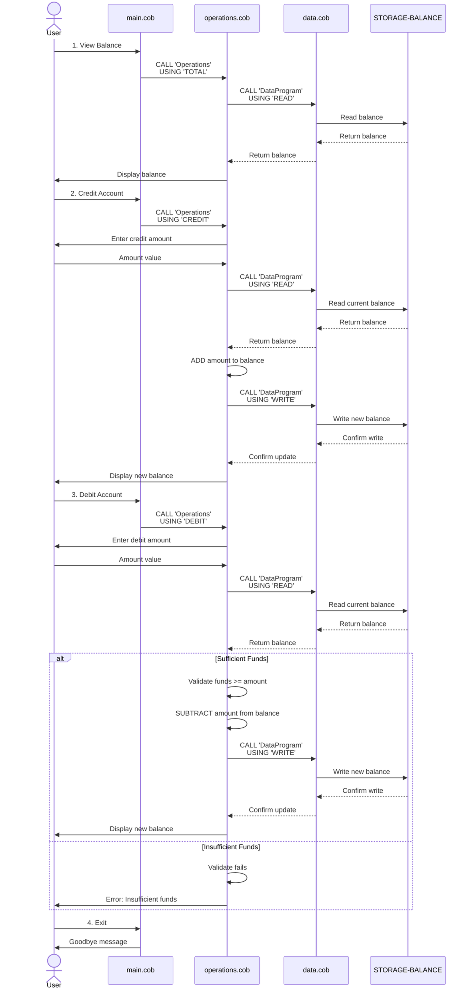

# COBOL Student Account Management System Documentation

## Overview

This legacy COBOL application manages student accounts, providing functionality to view balances, credit accounts, and debit accounts. The system consists of three interdependent modules that work together to handle account operations.

---

## COBOL Files Documentation

### 1. main.cob - Main Program Entry Point

**Purpose:**
- Serves as the primary entry point and user interface for the Account Management System
- Presents a menu-driven interface for student account operations
- Controls program flow and delegates operations to the Operations module

**Key Functions:**
- **MAIN-LOGIC**: Implements a menu loop that displays options and processes user choices
  - Displays a numbered menu with four options
  - Accepts user input (1-4) for different operations
  - Routes user selection to appropriate operation handlers
  - Continues until user selects exit option (4)

**Menu Options:**
1. View Balance - Shows current account balance
2. Credit Account - Deposits money to the account
3. Debit Account - Withdraws money from the account
4. Exit - Terminates the program

**Business Rules:**
- Program runs in a continuous loop until the user selects "Exit"
- Accepts numeric choices (1-4); invalid entries display an error message
- Each operation is delegated via CALL statements to the Operations module
- Program terminates gracefully with an exit message

---

### 2. data.cob - Data Storage Module

**Purpose:**
- Manages persistent account data storage
- Acts as a data access layer for reading and writing account balances
- Maintains the authoritative account balance value

**Key Functions:**
- **PROCEDURE DIVISION**: Handles data operations based on operation type
  - **READ Operation**: Retrieves the current stored balance
  - **WRITE Operation**: Updates the stored balance with a new value

**Data Variables:**
- `STORAGE-BALANCE` (PIC 9(6)V99): Stores the student's account balance with support for decimal values up to $999,999.99
- Initial value: $1,000.00

**Business Rules:**
- Account balances are stored with two decimal places (currency format)
- Balance is stored as a persistent value within the program session
- Only READ and WRITE operations are supported
- The module uses the LINKAGE SECTION to receive parameters from calling programs

---

### 3. operations.cob - Business Logic Operations Module

**Purpose:**
- Implements core account operations: view balance, credit, and debit
- Enforces business rules such as insufficient fund checks
- Orchestrates interactions between user input, data retrieval, and storage

**Key Functions:**

1. **TOTAL Operation** - View Account Balance
   - Retrieves current balance from data storage
   - Displays the balance to the user
   - No validation required

2. **CREDIT Operation** - Deposit Money
   - Prompts user to enter the credit amount
   - Retrieves current balance from storage
   - Adds the credit amount to the existing balance
   - Writes the updated balance back to storage
   - Displays the new balance

3. **DEBIT Operation** - Withdraw Money
   - Prompts user to enter the debit amount
   - Retrieves current balance from storage
   - **Validates** that sufficient funds exist before processing
   - If funds are sufficient:
     - Subtracts the debit amount from balance
     - Writes the updated balance to storage
     - Displays the new balance
   - If funds are insufficient:
     - Displays an error message
     - Does NOT process the transaction
     - Balance remains unchanged

**Business Rules:**
- All amounts are processed with two decimal places (currency)
- Debit operations are subject to an insufficient funds check
- Credit operations are always allowed
- Balance cannot go negative
- Operations fail gracefully with user-friendly error messages
- Each operation calls the DataProgram module to read/write persistent data

---

## Student Account Business Rules Summary

### Account Management
- Students start with an initial balance of $1,000.00
- Account balances support currency values up to $999,999.99

### Credit Operations
- Unlimited deposits are allowed
- Credits immediately increase the account balance
- No validation or approval process required

### Debit Operations
- Withdrawals require sufficient funds verification
- Transactions are rejected if the account has insufficient funds
- Failed transactions do not modify the account balance
- Customers are notified of insufficient funds with an appropriate message

### Security & Data Integrity
- Balance updates follow a read-modify-write pattern
- Data consistency is maintained through the DataProgram module
- All operations are logged implicitly through the persistent balance value

### System Operation
- Menu-driven interface for ease of use
- Input validation for menu choices (1-4)
- Continuous operation until user selects exit
- Graceful shutdown with user confirmation message

---

## Architecture Overview

```
┌──────────────────┐
│   main.cob       │
│ (User Interface) │
└────────┬─────────┘
         │
         ├─── CALL 'Operations' ───┐
         │                         │
         │                    ┌────▼────────────┐
         │                    │ operations.cob  │
         │                    │ (Business Logic)│
         │                    └────┬────────────┘
         │                         │
         │                    CALL 'DataProgram'
         │                         │
         │                    ┌────▼──────────┐
         └───────────────────→│ data.cob      │
                              │ (Data Storage)│
                              └───────────────┘
```

---

## Data Flow Sequence Diagram

The following diagram illustrates how data flows through the system for different operations:



---

## Modernization Considerations

This legacy COBOL system is a candidate for modernization to:
- Migrate to modern programming languages (Java, Python, Node.js)
- Implement a REST API for remote access
- Add database persistence (SQL database instead of in-memory storage)
- Implement proper authentication and authorization
- Add comprehensive logging and audit trails
- Create unit and integration tests
- Implement transactional safety and concurrency control
